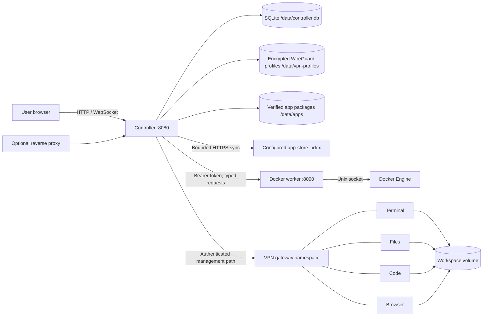

# Architecture

## Components



The Compose management network is shared by the controller, worker and
dynamically-created workstation gateway containers. It is not the
workstation's outbound network design. VPN app containers use Docker's
`container:<gateway>` network mode, so their only network stack is the Gluetun
gateway.

## Trust and package boundaries

- `internal/httpapi`: HTTP parsing, authorization, rendering and proxy entry.
- `internal/workstations`: explicit state transition rules.
- `internal/database`: all persistence and migrations.
- `internal/manifests` and `internal/templates`: strict configuration scanners.
- `internal/appstore`: bounded catalogue sync, content verification, version
  activation and rollback.
- `internal/workerclient`: only controller-to-worker protocol knowledge.
- `internal/dockerworker`: Docker Engine access and resource validation.
- `pkg/workerapi`: small shared request/response types.

The controller binary cannot access the Docker socket. The worker does not
contain user authentication, UI, SQLite, or a shell/exec endpoint.

Core Desktop and Terminal packages are read-only release configuration.
Optional packages are downloaded into controller data only after the catalogue
index, bundle metadata and every payload hash validate. The worker persists a
second approval for the exact runtime specification before the controller
activates a store package.

## Lifecycle

```text
creating → pulling-images → creating-storage
  → starting-vpn → waiting-for-vpn → starting-apps → ready
  → stopping → stopped
  → deleting → deleted
```

Non-VPN templates skip the two VPN states. Failures become `error`; VPN runtime
failure may be represented as `vpn-failed` or `locked`. Database state updates
use compare-and-swap semantics so concurrent actions cannot silently overwrite
one another.

Creation is asynchronous. The database record and event are committed first,
then the worker pulls approved images, creates labelled volumes and starts
containers. The controller only marks the workstation ready after the worker
has observed gateway and app health.

An update follows `ready → pulling-images → creating-storage → … → ready`.
The worker first pulls all allowlisted images, then replaces only app and VPN
containers. Workspace, shell-home and app-data volumes keep their deterministic
labels and survive the rebuild.

## Routing

For controller-path access:

```text
/workstations/ws-abc123def4/apps/terminal/
```

For wildcard DNS, set `PUBLIC_BASE_DOMAIN=workstations.example.com` and forward
both the controller name and `*.workstations.example.com` to port 8080:

```text
ws-abc123def4.workstations.example.com/apps/terminal/
```

The controller resolves the workstation, validates the server-side session and
ownership, checks app installation/readiness, then proxies HTTP or WebSocket
traffic. App containers never publish host ports.

Share traffic uses `/share/<secret>` once, then
`/shared/<workstation-id>/...` with a path-scoped cookie. This routing surface
has no dashboard, logs, metrics or administrative endpoints.

## Reconciliation

At startup the controller compares non-deleted SQLite records with worker
resources labelled `managed-by=workstation-manager`. Missing resource sets mark
records as errors. Orphaned resources are logged and retained for an
administrator; reconciliation never silently deletes volumes.
